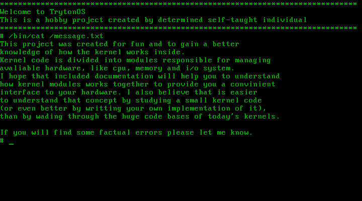

Based on [TrytonOS i386](https://gitlab.com/Tryton77/trytonos) minimalistic x86 kernel

# **POLX - Polish Unix-like Operating System**
This project takes developer knowledge to the beyond which leads to create Unix-like OS

## Roadmap
- [x] **Kernel**
    - [x] Main function
    - [x] Architecture depend
        - [x] Bootstraping
        - [x] GTD
        - [x] IDT
            - [x] Exceptions
            - [x] IRQ
            - [x] Syscalls
        - [x] Paging
            - [x] On demand paging (without second storage support)
        - [x] Ring 3
    - [x] Memory management
        - [x] Physical memory manager
        - [x] Virtual memory manager
    - [x] CPU management
        - [x] Core abstraction
        - [x] Scheduler
        - [x] ELF loader
    - [x] Virtual file system
        - [x] FS abstraction
        - [x] File descriptors
        - [x] Namei
        - [x] Initrd
        - [x] Ramfs
    - [ ] Inter-process communication
        - [x] Signals (inside kernel only)
        - [ ] Shared memory
    - [x] Device drivers
        - [x] Terminal
        - [x] Timer
        - [x] PIC
        - [x] Keyboard
- [x] **Basic standard C library**
    - [x] Programs loader
    - [x] Syscalls wrappers
    - [x] Basic functions
        - [x] malloc
        - [x] free
        - [x] printf
        - [x] perror
        - [x] readline
        - [x] strlen
- [x] **Operating system**
    - [x] Init
    - [x] User shell
    - [x] Shell misc programs
