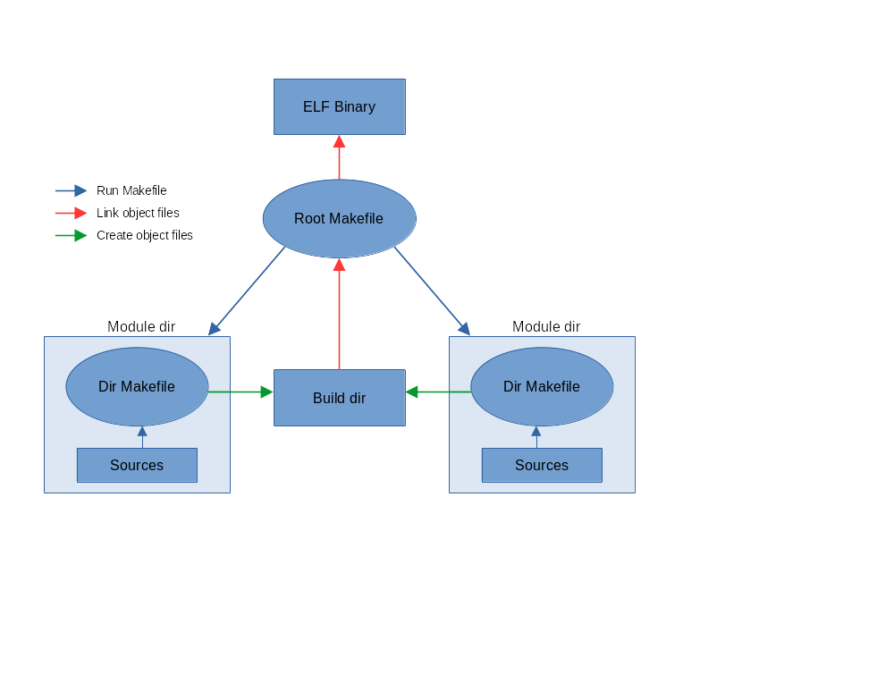

# **Build System**

1. The main makefile runs each directory makefile in turn
2. Each sub makefile compile all sources and saves objectfiles in main build directory
3. The main makefile linking all object files into final product

