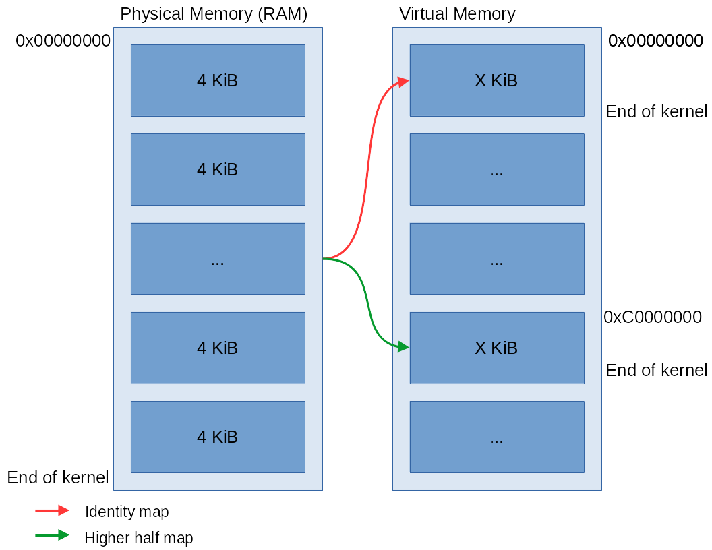

# ***Kernel bootstrap i386***
[Processor state after bootloader loads the kernel](https://www.gnu.org/software/grub/manual/multiboot/html_node/Machine-state.html)   
**Bootstrap routine**:    

1. [Paging](#paging)   
2. Start kernel main function
3. [GDT](#global-descriptor-table)     
4. [IDT](#interrupt-descriptor-table)   
5. [TSS](#task-state-segment)   
6. [Timer init](#timer-initialization)   
7. [PMM init](#physical-memory-manager-initialization)   

# ***bootstrap.s***
Setup stack for the rest of kernel code   

## Paging
Kernel will be mapped to high memory (0xC0000000), to achive this bootstrap code fills page table up to the end of kernel physical location. Next step is to map prepared PT into PD onto 0 index (identity mapping) and 768 index (higher half of memory). Last step before run kernel in higher half is to make PD recursive, it achive this via mapping PD physical address into last index 1023 in the same PD.

Identity mapping is needed to run code in higher half of memory, because when we enable paging EIP will be pointing and executing last instructions in lower memory (0x100000). When we will not create identity mapping and next instruction arrives then we will got a page fault exception and our PC will restart, because we don't have already initialized handler for interrupts.   
Final step is to jump to the higher half code where we can safely remove identity mapping and flush TLB to avoid translating lower half addresses correctly.    

# ***arch_init.c***
## Global Descriptor Table
CPU specific binary data structure containing entries (descriptors) whose inform CPU about memory segmetation.
We initialized flat memory segmentation for compatibility with modern compilers. [Details](https://wiki.osdev.org/Global_Descriptor_Table)   
   
***Nessesary descriptors:***   
* NULL   
* Kernel mode code segment   
* Kernel mode data segment   
* User mode code segment   
* User mode data segment   
* Task state segment   

## Interrupt Descriptor Table
Similar data structure to GDT but containing descriptors that inform processor where to find routine to handle specific interrupt. [Details](https://wiki.osdev.org/Interrupt_Descriptor_Table)   
 
### ***CPU exceptions:***   
0. Divide Error   
1. Debug Exceptions   
3. Breakpoint   
4. Overflow   
5. Bounds Check   
6. Invalid Opcode   
7. Coprocessor Not Available   
8. Double Fault   
9. Coprocessor Segment Overrun   
10. Invalid TSS   
11. Segment Not Present   
12. Stack Exception   
13. General Protection Exception(Triple Fault)   
14. Page Fault   
16. FPU Floating-Point Error   
17. Alignment Check   
18. Machine Check   
19. SIMD Floating-Point Exception   
20. Virtualization Exception   
21. Control Protection Exception   
2, 15, 22-31  Intel reserved   

###  ***Interrupt requests:***
32. Timer   
33. Keyboard   
34 - 47 Not implemented yet   

### ***Syscalls trigger:***
48. Syscall

## Task State Segment
CPU specific data structure containing information about executing task. [To properly handle interrupts from ring 3 we fill only informations about kernel stack](https://en.wikipedia.org/wiki/Task_state_segment#Inner-level_stack_pointers). [Details](https://wiki.osdev.org/Task_State_Segment)   

## Timer initialization
Initialize timer on 200Hz frequency and mask timer IRQ   

## Physical Memory Manager initialization
To initialize PMM we pass pointer to mb_info struct which contains information about available memory and labels from linker script which will mark memory used by kernel as inavailable.   