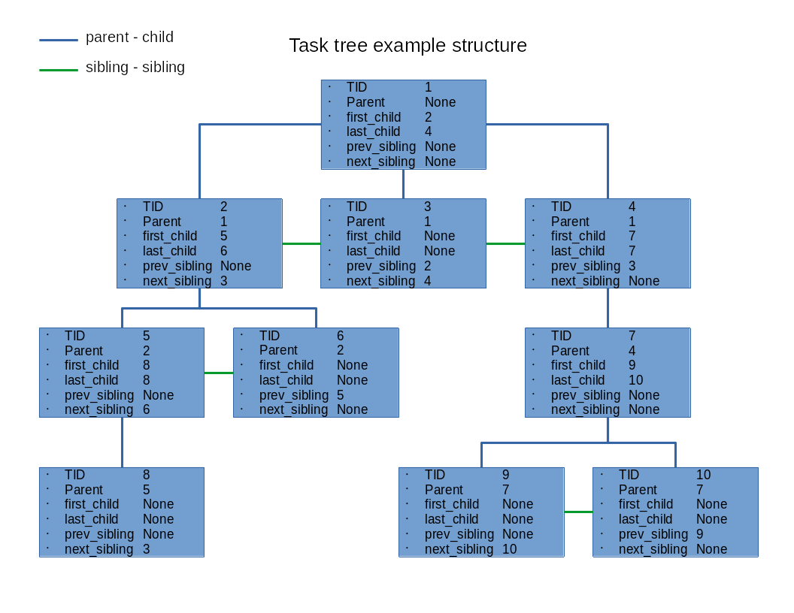

# TODO
- [ ] Implement task id generator with posibibility to use previously destroyed id's

# ***"CPU abstraction"***
Table of contents:    
0. [What is task](#what-is-task)   
1. [Tasks tree](#tasks-tree)   
2. [Task control block](#task-control-block)   

3. [Task management](#task-management)    
    - [Create](#task-creation)   
    - [Destroy](#task-destroing)   
    - [Switch](#task-switching)   

# What is task
Task is a basic execution unit used to virtualize the physical core of the processor. Used to create illusion that every running program (process) has his own CPU core, which consequently allows concurrent running of programs. Each task has its own processing resources like address space, special and general purpose registers, opened files and so on. Processing resources are called **task context** which is mostly dependent on the physical processor and it is stored in task control block (TCB). 

# Tasks tree


#  Task Control Block
```c
struct tcb {
	/* General informations */
	tid_t task_id;
	uintptr_t kernel_stack;
	int exit_code;
	
	/* File descriptors */
	size_t fd_ctr;
	fd_t *used_fd[MAX_FDS];
	
	/* Signals */
	sig_t mask;
	sig_t current;
    
    /* waitpid syscall */
	struct tcb *wait4;

	/* Task tree structure */
	struct tcb *parent;
	struct tcb *first_child, *last_child;
	struct tcb *prev_sibling, *next_sibling;

	/* CPU scheduler info */
	task_state_t state;
	task_priority_t priority;
	struct tcb *next, *prev;

	/* Task context */
	task_regs_t regs;	    /* CPU registers */
	vmm_aspace_t *aspace;	/* AS abstraction */
};
typedef struct tcb task_t;
```

# Task management
## Task creation
- Allocate space for tcb struct on heap   
- Generate task_id   
- Allocate kernel_stack      
- Update task tree structure      

## Task destroing   
- Destroy task_id and kernel_stack   
- Destroy task address space     
- Kill all task childs
- Update task tree structure   
- Release tcb struct memory   

## Task switching 
**Automatical switch:**   

- If actual_task->next == NULL and it's not an empty task
    - Ask scheduler for next task

- Update global var actual_task
- Handle received signals   
- perform context switch   

**On demand switch:**    

- Update global var actual_task
- Handle received signals   
- preform context switch

**Architecture dependent context switch:**   

- Update TSS stack location   
- Load PD of the new task   
- Flush old TLB entries   
- Build frame for iret
- Set segment registers
- Load registers state from new task tcb    
- Jump into ring 3  