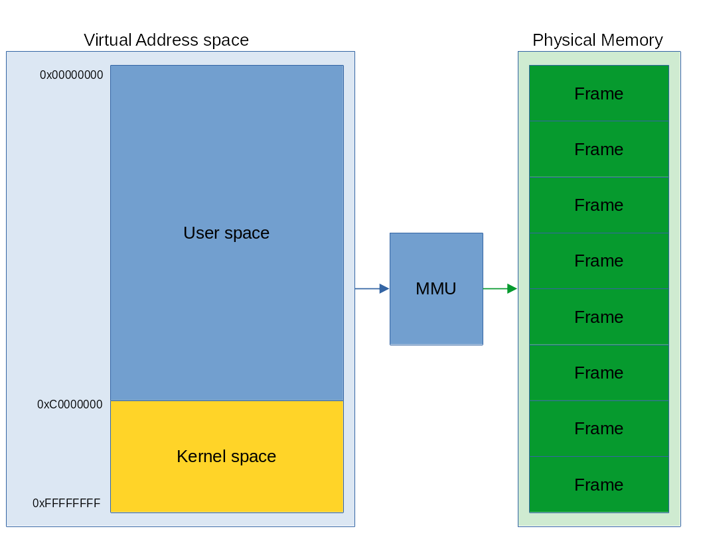
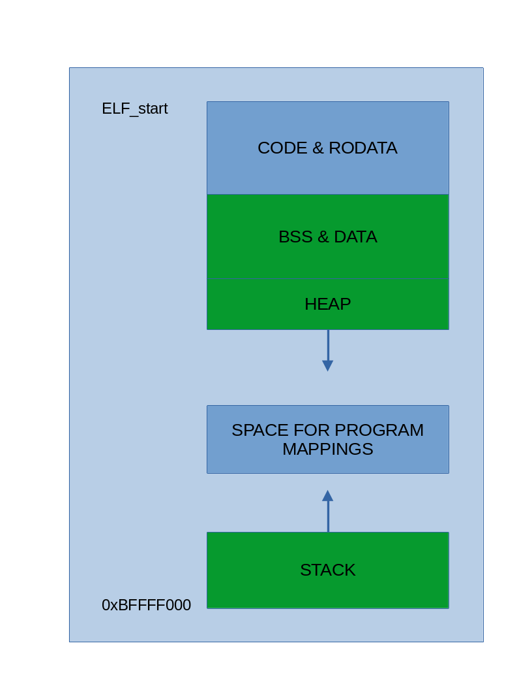

# ***Virtual Memory***
Virtual memory is a physical memory management mechanism that envolve invisible (from process view) abstraction of phisical memory. Its allows processes to think they have all the address space to use, while their data can be stored in different locations in physical memory or moved to the helper memory. It also provides virtual addressing scheme.   
   
Table of contents:   
0. [CPU](#from-cpu-perspective)   
1. [Kernel](#kernel-perspective)   
2. [Process](#process-perspective)   

# **From CPU perspective**
As we should already know modern CPUs had build-in memory controller that is connected with RAM via bus. This controller uses phisical addresses to access appropriate RAM cell. When we enable paging processor will work only with virtual addresses.

## **Virtual address to Phisical address translation**
Processors have built-in adress _translator_ that is called MMU - Memory Management Unit. In simple words it turn virtual address to physical address via [paging structures](#paging). 

## **Paging**
[Paging](https://wiki.osdev.org/Paging)  
[Recursive PD](http://www.thomasloven.com/blog/2012/06/Recursive-Page-Directory)
   
***Page table*** - 1024 entries array, each entry indicate one frame mapped to virtual address space or its lack. One PT can map 4MiB of address space when 4KiB pages are used.   
   
***Page directory*** - 1024 entries array of page tables. Its root of process address space, that structure hold whole 32bit address space - 4GiB.   

We need to inform CPU where in **physical memory** is PD, we use CR3 register for that.   

# Kernel perspective
How kernel manage virtual address space

After bootstrap we have kernel mapped to 0xC0000000 address in virtual memory. Addresses from 0x00000000 to 0xBFFFFFFF will make process address space where kernel will map all nessesary process data like .text, .data segments, stack and so on.   

***Virtual address space***

* 0xC0000000 - kernel_vaddr_end  => Mapped kernel image 
* kernel_vaddr_end - 0xCFFFFFFF => [kmalloc](#kmalloc)
* 0xD0000000 - 0xEFFFF000 => [vmalloc](#vmalloc)
* 0xFF7FE000 => Temorary mapping spot
* 0xFF7FF000 => Second tmp mapping spot
* 0xFF800000 => External PD page table access
* 0xFFBFF000 => External recursive PD
* 0xFFC00000 => Page tables access via recursive PD
* 0xFFFFF000 => Recursive PD

## Demand paging and COW mechanism
**Demand paging** is implemented by reserving some region of virtual adress space, but not allocating any physical frames. When kernel want to use some piece of that region page fault occur and page fault handler are going to allocate new frame. When page fault occur in process address space page fault will call virtual memory page fault handler which is going to check if process have permision to use that address, and then it will alocate new frame.   

// TODO
**Copy on write mechanism** is used to share data by many processes to avoid multiple copies of same data. It is implemented by removing write permision on pages from specyfied region of memory. If *process A* want to write into that region page fault will occur then vmm will check its permissions and it will make mirror copy of shared frame which will be mapped into *process A* AS with write permission. If region was shared only by two processes vmm will change original frame permision into writable during next page fault caused by *process B* trying to access shared region.

## Kernel memory allocators
### kmalloc
Provide allocation of different size chunks. It cannot be used to allocate paging structures whose must be page-aligned.

### vmalloc
Provide allocation of chunks that size is page size multiplication. It guarantees that returned chunk will be page-aligned.
Can be used to space allocation for DMA and paging structures.   

# Process perspective
Process virtual memory is created by execve syscall, and can be managed by mmap, brk or sbrk syscalls.   
