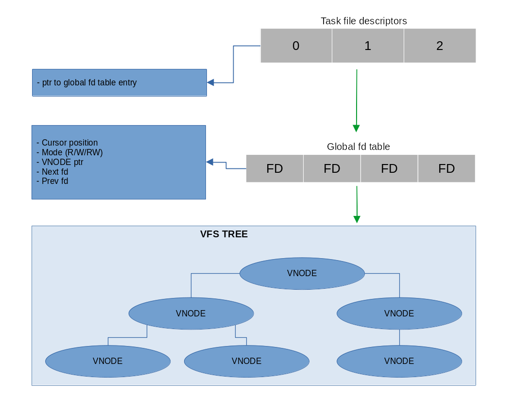

# ***File from running program perspective***
Table of contents:   

0. [Subsystem overview](#fd-subsystem-overview)   
1. [Data structures](#data-structures)   

2. [API](#api)      
- [Add to global fd table](#add-to-list)   
- [Remove from global fd table](#remove-from-list)   


# FD subsystem overview



#  _<kernel/fd.h>_
## Data structures
### File descriptor
```c
struct file_descriptor {
	size_t position;
	int mode;
	vfs_node_ptr_t vfs_node;

	struct file_descriptor *next, *prev;
};
typedef struct file_descriptor fd_t;
```
## API
### Add to list
```c
void fd_add(fd_t *fd);
```
Add fd to global list

### Remove from list
```c
void fd_remove(fd_t *fd);
```
Remove fd from global list