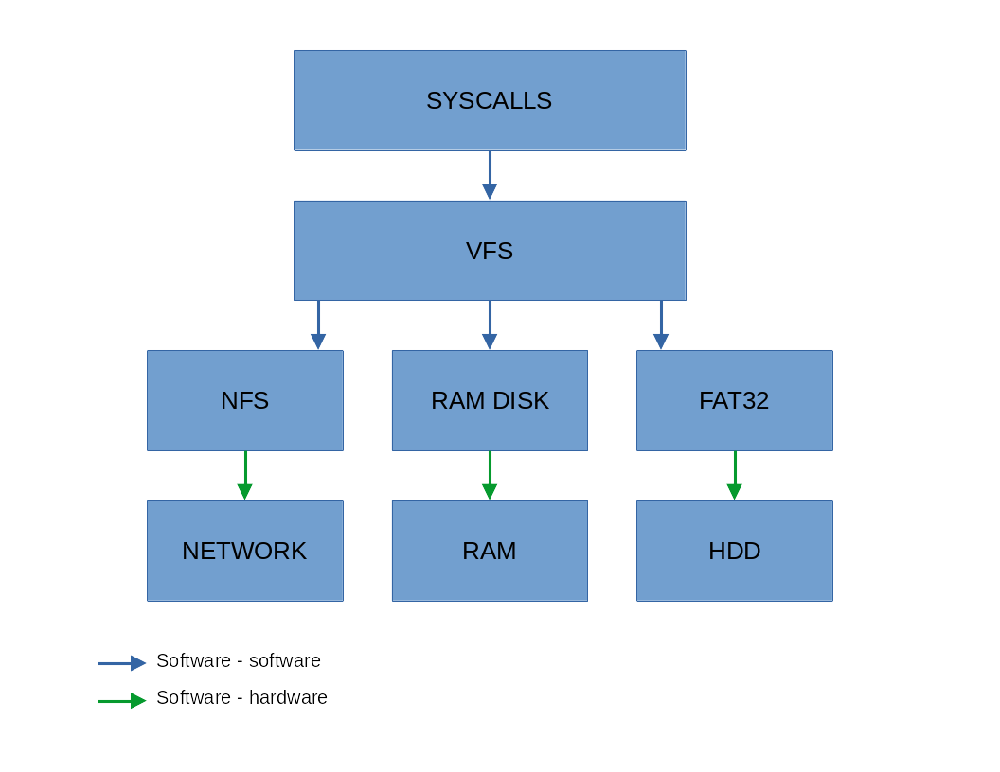

# ***Virtual filesystem***
Table of contents:   
0. [What it is](#what-is-virtual-file-system)   
1. [Internal structure](#internal-structure-of-vfs)   

2. [API](#api)   
    - [open](#open)   
    - [close](#close)   
    - [read](#read)   
    - [write](#write)   
    - [touch](#touch)   
    - [remove](#remove)   
    - [mkdir](#mkdir)   
    - [rmdir](#rmdir)   
    - [readdir](#readdir)   

# What is virtual file system
Virtual file system is an abstraction to unify access to data stored on helper storage or accesible over a network. That abstraction is done via layers like shown below.

User programs doesn't have to know where the file is stored physicaly it just use same interface to access everything, leaving rest job to vfs.   

# _<kernel/vfs.h>_

TODO:   
- [ ] CHRDEV   
- [ ] BLKDEV   
- [ ] PIPE   
- [ ] SYMLINK   
- [x] MNTPT   

## Internal structure of VFS
Virtual file system is build on tree of the vnodes. Each vfs_node represent one file that can be interpreted as regular file, dir, block device and so on, it hold functions pointers to its filesystem that can serve all requests relating to that vfs_node. VFS is responsible for wrappers for vfs_node operations.

### vfs_node
```c
struct vfs_node {
	char name[MAX_FILENAME]; /* Filename */
	// Place for permissions, owner etc
	vfs_type v_type;	 /* Type of file */
    size_t ino; 		 /* Unique number used by filesystem */
	size_t size;		 /* Size of file */
	size_t active_fds;	 /* Active file descriptors counter */
	vfs_ops_t op;		 /* Pointers to possible operations on file */
    
    /* Virtual filesystem tree */
	vfs_node_ptr_t *parent;
	vfs_node_ptr_t *first_child, *last_child;
	vfs_node_ptr_t *prev_sibling, *next_sibling;
    
    void *data;          /* Private fs data */
};
typedef struct vfs_node vfs_node_t;
```

###  vfs_node types
```c
typedef enum {
	VFS_FILE = 1,
	VFS_DIR,
	VFS_CHRDEV,
	VFS_BLKDEV,
	VFS_PIPE,
	VFS_SYMLINK,
	VFS_MNTPT
} vfs_type;
```

### vfs_node operations
```c
struct vfs_operations {
	int (*open) (vfs_node_ptr_t, int);
	int (*close) (vfs_node_ptr_t);
	long (*read) (vfs_node_ptr_t, size_t, size_t, char *);
	long (*write) (vfs_node_ptr_t, size_t, char *, size_t);
	int (*touch) (vfs_node_ptr_t, vfs_node_ptr_t *,char *, int);
	int (*remove) (vfs_node_ptr_t);
	int (*mkdir) (vfs_node_ptr_t, vfs_node_ptr_t *,char *, int);
	int (*rmdir) (vfs_node_ptr_t);
	int (*readdir) (vfs_node_ptr_t, size_t, vfs_dirent_t *);
};
typedef struct vfs_operations vfs_ops_t;
```

## API
### open
```c
int vfs_open(vfs_node_ptr_t node, int mode);
```
### close
```c
int vfs_close(vfs_node_ptr_t node);
```
### read
```c
long vfs_read(vfs_node_ptr_t node, size_t offset, size_t size, char *buffer);
```
### write
```c
long vfs_write(vfs_node_ptr_t node, size_t offset, char *buffer, size_t size);
```
### touch
```c
int vfs_touch(vfs_node_ptr_t p_node, vfs_node_ptr_t *node, char *name, int mode);
```
### remove
```c
int vfs_remove(vfs_node_ptr_t node);
```
### mkdir
```c
int vfs_mkdir(vfs_node_ptr_t p_node, vfs_node_ptr_t *node, char *name, int mode);
```
### rmdir
```c
int vfs_rmdir(vfs_node_ptr_t node);
```
### readdir
```c
int vfs_readdir(vfs_node_ptr_t node, size_t no, vfs_dirent_t *dent);
```