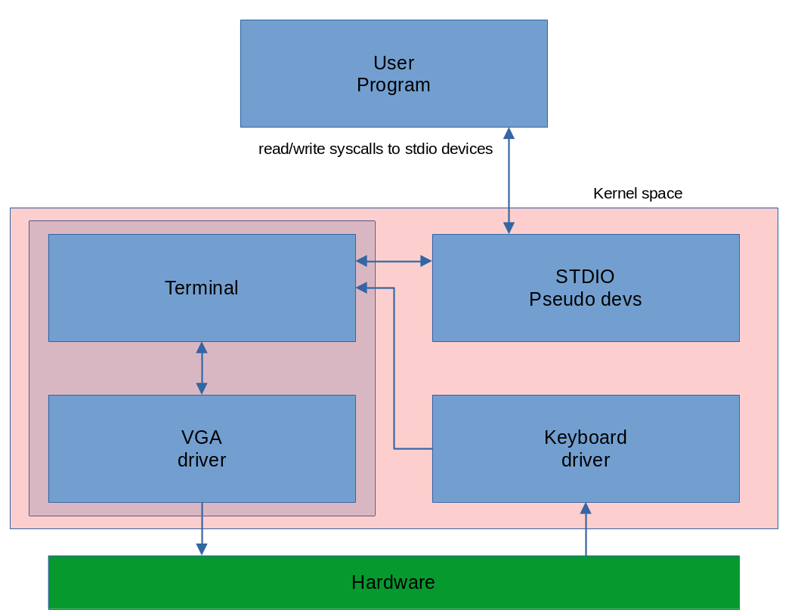

# Human-computer interface
It allow us to provide data to programs and also get feedback from them in interactive way via read/write syscalls to stdio pseudo devices. HCI infrastructure is shown in the following picture.   

# Terminal
Terminal - simple device controlled by stdio pseudo devices or directly by kernel, that is responsible for printing on screen kernel errors and user programs writes via built-in VGA driver. It also use keyboard input to write chars to screen or edit previously provided data.   

# Printing string on screen from userspace program
1. Call write syscall with file descriptor indicating stdout device as argument
2. write syscall handler calls vfs_write which calls internal stdout_write function
3. stdout dev calls teminal_writestring function to print provided string

# Keyboard button was pressed
1. Interrupt was generated and int handler calls proper isr
2. Keyboard driver turns scancode into ASCII char if possible
3. Keyboard driver calls terminal_putchar_from_kbd function   
4. Terminal will print it if it is a printable char or run proper action if it is a special key

# Getting input from user
1. Call read syscall with file descriptor indicating stdin device as argument
2. read syscall handler calls vfs_read which calls internal stdin_read function
3. stdin_read put caller task into sleep queue and it will save its task_id   

Now task will wait until user will provide input via keyboard and press enter key, in the meantime other programs will be scheduled and executed.

4. If enter was pressed terminal calls SPECIAL stdin function
5. sdtin dev copy input line into task AS and set return value
6. Then it remove task from sleep queue